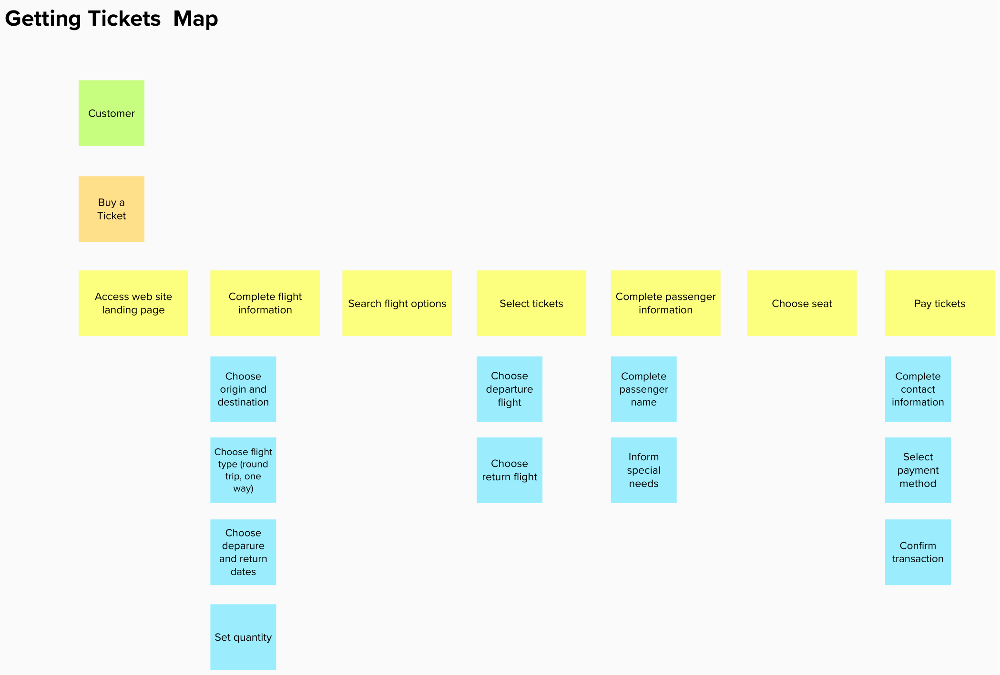
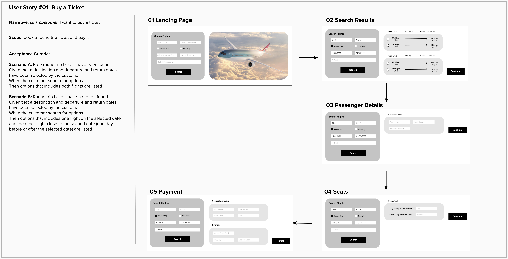
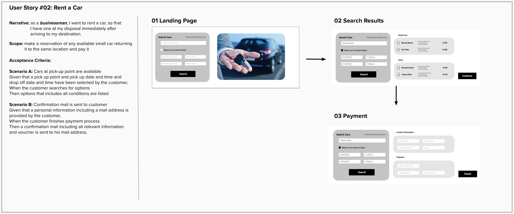
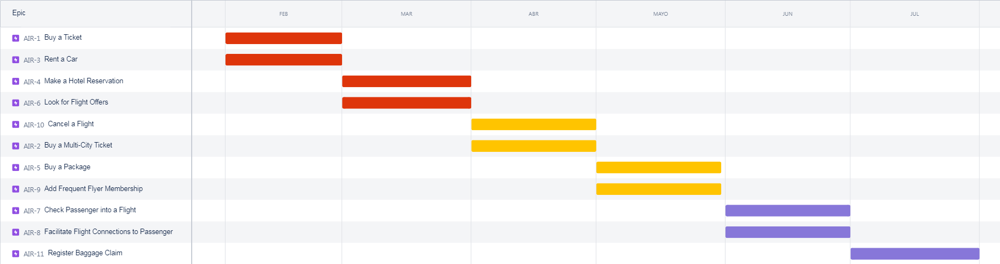

# Airline web page

## Index

- Assumptions
- Product Backlog
- "Getting Tickets" Diagram
- User Stories
- Epics Timeline

## Assumptions
- Focused on two types of users
    - Customer (*businessman*, *tourist*)
    - Airline representative in airport
- MVP must be up & running in two months
- Software Development Contract will finish in six months
- Car Rental Service is provided by a Car Rental Booking Site via API calls

## Product Backlog
- Epic #01 "Buy a Ticket": 
    > as a **customer**, I want to buy a Round Trip ticket, providing only my destination and dates so that I will be able to plan the rest of my trip  
    > as a **businessman**, I want to buy an open ticket providing only my destination so that I have flexibility planning my trip
- Epic #02 "Buy a Multi-City Ticket":  
    > as a **tourist**, I want to buy tickets to multiple destinations hopping from one place to the next one after a few days, so that I can make the reservation process simpler.
- Epic #03 "Rent a Car":
    > as a **businessman**, I want to rent a car so that I have one at my disposal immediately after arriving to my destination
- Epic #04 "Make a Hotel Reservation":
    > as a **tourist**, I want to make a hotel reservation so that I can check into my room at whatever the time my flight arrives to my destination
- Epic #05 "Buy a Package":
    > as a **tourist**, I want to buy a package that includes flight tickets, car rental and hotel reservation providing only my destination and travel start and end dates, so that my reservation process will be easier and cheaper
- Epic #06 "Look for Flight Offers":
- Epic #07 "Check Passenger in to a Flight":
- Epic #08 "Facilitate Flight Connections to Passenger": 
- Epic #09 "Add Frequent Flyer Membership":
- Epic #10 "Cancel a Flight":
- Epic #11 "Register Baggage Claim":

## "Getting Tickets" Diagram

## User Stories

### User Story #01 - Buy a Ticket

### User Story #02 - Rent a Car 

## Epics Timeline

| Color | Tag |
|-------|-----|
| Red | MVP - Basic Customer Features |
| Yellow | Extended Customer Features |
| Purple | Airline Representative Features |

